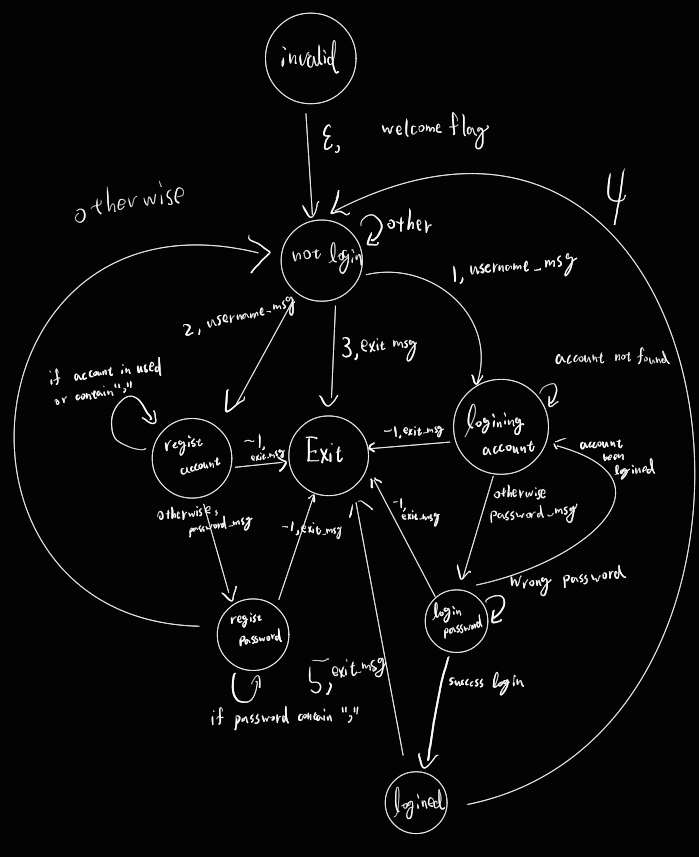

# Project Phase 1 ReadMe

## how to use

`make` to build up the server and client
`./server <port>` start server at port `<port>`
`./client <hostname/address> <port>` connect to the server at `<hostname/address>:<port>`

## server

### init server

set up the socket(listen_fd) we are listening connection with `socket(AF_INET, SOCK_STREAM, 0);`
bind listen_fd to the `<port>`
listen listen_fd with at most `MAX_CLIENTS` clients

### accept connection

I use `accept(svr.listen_fd, (struct sockaddr*)&cliaddr, (socklen_t*)&clilen);` for accept a new connection from listen_fd
connecton socket will store in conn_fd
and then create a new thread to handle this connection
(when thread run `handle_client`, it will send start massage to client)

### login system

here is the main logic

## client

get address from hostname and make clientSocket connect to `<host>:<port>`

use io multiplexing to handle clientSocket and STDIN

if client get massage from socket
put it to stdout

if client write massage to STDIN
send it to server
